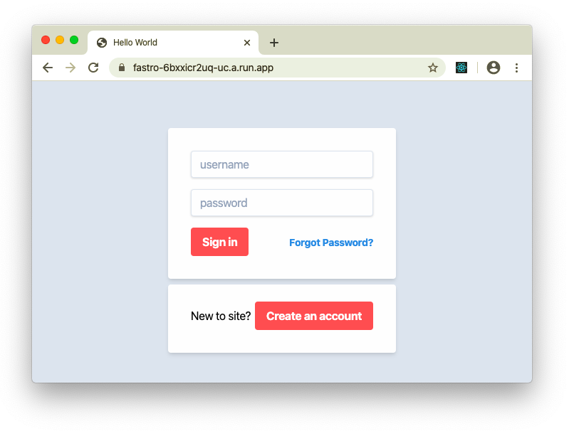

 [](http://standardjs.com)

# fastro-web

Create `React` Single Page Application (SPA) & its API end point in the same codebase.

Powered by `fastify` via `fastro` dependency injection, `typescript`, `typeorm`, and `webpack`. 

Hot module replacement (HMR) ready.

- [Prerequisites](#prerequisites)
- [Getting Started](#getting-started)
- [Development](#development)
- [Folder Structure](#folder-structure)
- [Detail docs](#detail-docs)
- [Tests](#tests)
- [Production](#production)
- [Docker Deployment](#docker-deployment)
- [Continuous deployment](#Continuous-deployment)
- [Live Demo](#live-demo)

## Prerequisites
Install these package first (macOS):
- `git`
- `mysql`
- `nodejs`
- [`vscode`](https://code.visualstudio.com/) (Recomended editor)
```
brew install git mysql node vscode
```

Create database with minimal setup: 
  ```
  database: 'test'
  username: 'root'
  password: 'root'
  ```

## Getting Started
Make a new project folder:
```
mkdir awesome-project && cd awesome-project
```
Install `fastro-cli` command line:
```
npm i fastro-cli -g
```
Run `fastro` command to clone `fastro-web` template, install dependencies & build all `typescript` files:
```
fastro init
```
Start webapp:
```
npm start
```
## Development

Run these commands on different terminal.
- Watch all `.ts` files and trigger recompilation on changes.
  ```
  npm run watch
  ```
- Run this command to start server on `development` mode & activate Hot Module Replacement (HMR).
  ```
  npm run dev
  ```
  HMR allows all kinds of modules to be updated at runtime without the need for a full refresh.

### Folder Structure
```
.
├── src
│   ├── main.ts
│   ├── plugins
│   │   ├── ejs.plugin.ts
│   │   ├── hmr.plugin.ts
│   │   ├── readme.md
│   │   └── static.plugin.ts
│   ├── services
│   │   ├── readme.md
│   │   ├── token
│   │   │   ├── __test__
│   │   │   │   └── token.service.spec.ts
│   │   │   ├── token.entity.ts
│   │   │   └── token.service.ts
│   │   ├── user
│   │   │   ├── __tests__
│   │   │   │   ├── user.controller.spec.ts
│   │   │   │   └── user.service.spec.ts
│   │   │   ├── user.controller.ts
│   │   │   ├── user.entity.ts
│   │   │   └── user.service.ts
│   │   └── web.controller.ts
│   ├── templates
│   │   ├── development.html
│   │   ├── production.ejs
│   │   └── readme.md
│   ├── web
│   │   ├── __tests__
│   │   ├── app.tsx
│   │   ├── assets
│   │   │   ├── readme.md
│   │   │   ├── styles.css
│   │   │   └── tailwind.css
│   │   ├── clients
│   │   │   ├── api.client.tsx
│   │   │   ├── auth.client.tsx
│   │   │   ├── readme.md
│   │   │   └── reducer.tsx
│   │   ├── components
│   │   │   ├── admin.tsx
│   │   │   ├── error.tsx
│   │   │   ├── gateway.tsx
│   │   │   ├── login.tsx
│   │   │   ├── notfound.tsx
│   │   │   ├── readme.md
│   │   │   └── register.tsx
│   │   ├── context
│   │   │   ├── auth.context.tsx
│   │   │   ├── context.ts
│   │   │   ├── readme.md
│   │   │   └── theme.context.tsx
│   │   ├── index.tsx
│   │   ├── readme.md
│   │   └── web.config.ts
│   └── webpack.config.ts
├── cloudbuild.yaml
├── docker-compose.yml
├── package-lock.json
├── package.json
├── postcss.config.js
├── readme.md
├── server.config.js
├── tailwind.config.js
├── tsconfig.build.json
└── tsconfig.json
```

### Detail docs
For more detail docs, check all `readme.md` file in every folder.
- [Configuration & Database](/server.config.js)
- [Create Server](/src/main.ts)
- [React Web (SPA)](/src/web/readme.md)
- [Add new end point](/src/services/readme.md)
- [HTML templates](/src/templates/readme.md)
- [Add plugins](/src/plugins/readme.md)

## Tests
This webapp use `jest` for testing. 

Check `__test__` folder inside `service` folder.

Run this command to test all service & endpoint.
```
npm test
```

## Production
If your test result is OK, run this command to build `production` mode.
```
npm run build
```

## Docker Deployment
Prerequisites: 
- Create or update `.env` file:
  ```
  DB_HOST=mysql
  ```
  Please note that `mysql` is hostname on [`docker-compose`](/docker-compose.yml). Full example of `env`:
  ```
  APP_PORT=8080
  DB_PORT=3306
  DB_HOST=mysql
  DB_USER=root
  DB_PASSWORD=root
  DB_DATABASE=test
  DB_SYNCHRONIZE=true
  DB_LOGGING=false
  ```
- Install & setup docker (macOS):
  ```
  brew install docker docker-machine docker-compose
  brew cask install virtualbox
  docker-machine create default
  docker-machine start
  ```

- Run this command, and remember the output. You can access database, web & adminer services with that IP:
  ```
  docker-machine env
  ```
  Output of `docker-machine env`:
  ```
  export DOCKER_TLS_VERIFY="1"
  export DOCKER_HOST="tcp://192.168.99.122:2376"
  export DOCKER_CERT_PATH="/Users/user/.docker/machine/machines/default"
  export DOCKER_MACHINE_NAME="default"
  # Run this command to configure your shell: 
  # eval $(docker-machine env)
  ```
- Configure your shel:
  ```
  eval $(docker-machine env)
  ```

Build image:
```
docker-compose build
```

Run database. Wait 10s:
```
docker-compose up -d mysql
```
Run webapp:
```
docker-compose up -d web
```
Run adminer:
```
docker-compose up -d adminer
  ```
View webapp log:
```
docker-compose logs -f web
```

## Continuous deployment
This webapp template use Google Cloud for continuous deployment.

- [Cloud run](https://cloud.google.com/run/docs) 
- [Cloud sql](https://cloud.google.com/sql/docs/)
- [Cloud build](https://cloud.google.com/run/docs/continuous-deployment-with-cloud-build)
- [Secret manager](https://cloud.google.com/secret-manager/docs) 

Check [cloudbuild.yaml](/cloudbuild.yaml) for detail.

## Live Demo
You can access live demo of this app via this [link](https://fastro-6bxxicr2uq-uc.a.run.app).

[](https://fastro-6bxxicr2uq-uc.a.run.app)
